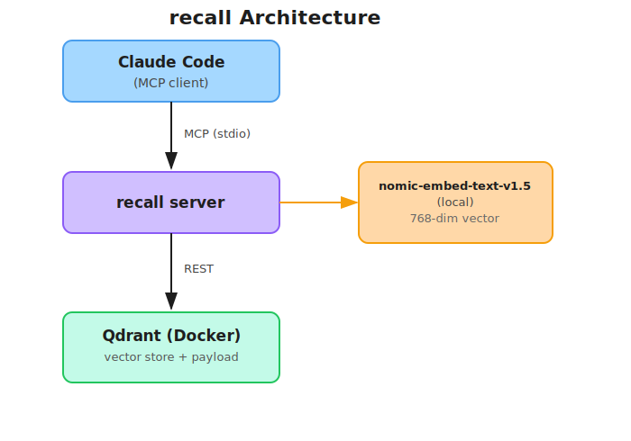

# recall

[日本語](./README.ja.md)

Session memory MCP server for Claude Code.
Saves conversation sessions as vector embeddings in Qdrant, enabling semantic search and context retrieval across conversations.

## What recall provides

- **Persistent session memory** — save work context (decisions, code references, GitHub links, artifacts) as structured records
- **Semantic search** — retrieve past sessions using natural language queries via vector similarity search
- **Fully local** — embedding model runs on-device; no external API calls or data transmission

## Tech Stack

| Component | Details |
| --- | --- |
| Language | TypeScript (ESM) |
| Protocol | MCP (Model Context Protocol) |
| Vector store | Qdrant (Docker) |
| Embedding model | [nomic-ai/nomic-embed-text-v1.5](https://huggingface.co/nomic-ai/nomic-embed-text-v1.5) (768 dim, local) |
| Schema validation | Zod |

## MCP Tools (8)

| Tool | Description |
| --- | --- |
| `preview_session` | Preview session data before saving |
| `save_session` | Save a session to Qdrant |
| `list_sessions` | List recent sessions in reverse chronological order |
| `load_session` | Load a session by number or session ID |
| `search_sessions` | Semantic search using a natural language query |
| `update_session` | Partially update specified fields |
| `compact_sessions` | Return raw session data for Claude to summarize and consolidate |
| `delete_session` | Delete one or more sessions by session ID |

## Architecture



1. On `save_session`, the session text is converted to a 768-dimensional vector by the local embedding model and stored in Qdrant alongside the structured payload.
2. On `search_sessions`, the query is vectorized the same way and Qdrant returns the nearest sessions by cosine similarity.
3. All processing is local — no data leaves the machine.

## Prerequisites

- Node.js >= 22
- Docker

## Setup

```bash
# 1. Clone the repository
git clone https://github.com/tamaco489/recall.git
cd recall

# 2. Install dependencies and download the embedding model
make setup

# 3. Start Qdrant
make up

# 4. Build
make build
```

## Register with Claude Code

Replace `/path/to/recall` with the absolute path where you cloned the repository.

**Global (available from any repository):**

```bash
claude mcp add --scope user recall -- node /path/to/recall/dist/index.js
```

**Per-project, shared with team (stored in `.claude/settings.json`):**

```bash
claude mcp add --scope project recall -- node /path/to/recall/dist/index.js
```

**Per-project, personal only (stored in `~/.claude.json` scoped to the project):**

```bash
claude mcp add --scope local recall -- node /path/to/recall/dist/index.js
```

Verify registration:

```bash
claude mcp list
```

Restart Claude Code to apply the change.

## Usage Examples

```text
# Preview and save today's work
Preview and save today's work.
Title: "recall Phase 6", repo: tamaco489/recall, layer: backend

# List sessions
Show me the list with list_sessions

# Load a session
Load session number 1

# Semantic search
Search for sessions related to "Qdrant vector store implementation"

# Update a session
Update the status of session abc123 to completed

# Compact old sessions (compact_sessions fetches raw data → Claude summarizes → save_session stores it)
Fetch raw data for sessions older than 2 weeks, summarize them, and save with save_session

# Delete sessions
Delete sessions with IDs abc123 and def456
```
